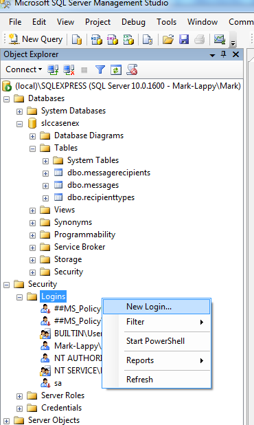
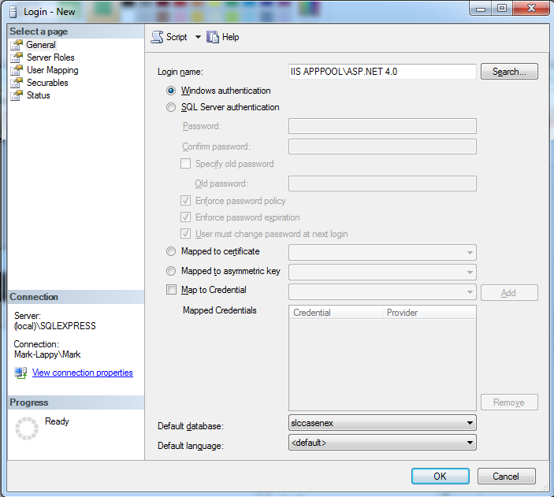
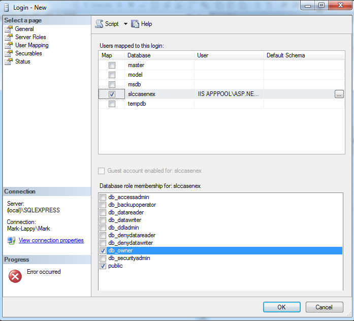

NOTE-e-FI - An SLC powered messaging system
==========

## Problem
Teachers need to easily notify and track academic performance, achievement data, attendance and anecdotals to parents and students while making their efforts transparent to administrators and staff. This will enable staff collaboration through this open communication.

## The Solution
NOTE-e-FI is a system that allows educators to send notes to parents, students and colleagues using filters based off of data housed in the SLC. Notes can be translated into home language using Azure translations. Logs are kept for each message to allow sharing of outreach information amongst school staff members. Messages and logs are also written back to the SLC.

## Prerequisites
- .NET Framework 4.0 (ASP.Net 4.0)
- Internet Information Services (IIS) 7.0 or Express (http://www.microsoft.com/en-us/download/details.aspx?id=7593)
- Entity Framework
- SQL Server Express 2008 (http://www.microsoft.com/en-us/download/details.aspx?id=22973)
- SQL Server Management Studio (http://www.microsoft.com/en-us/download/details.aspx?id=7593)

## License
This project is covered by the Apache 2.0 license. For more information, please visit http://www.apache.org/licenses/LICENSE-2.0.html

## Getting Started
To get up and running, you will need to set up your own sandbox and application within the SLC Data Store. Follow the directions in the link below and you will end up with a Client ID and Client Secret you can put in the web.config.

http://dev.slcedu.org/getting-started

You will also need to set up a SQL Server 2008 Express database to save messages. After cloning the repo and opening the solution in Visual Studio, open the `create_database.sql` script in SQL Management Studio to create the database.  Once the database is created by running the script, you will need to connect it to IIS:

1. In the object explorer of SQL Management Studio, go to the folder called "Security", then the folder called "Login" . Right click on this folder and click "New Login".

2. Set the "Login name" to "IIS APPPOOL\ASP.NET 4.0" - Default database is "slccasenex" (do not click OK yet)

3. On the User Mapping tab, check the database "slccasenex", and check the role "db_owner"

4. Click OK. If you receive an error, ensure that you have IIS installed and it contains an application pool for ASP.NET 4.0.

